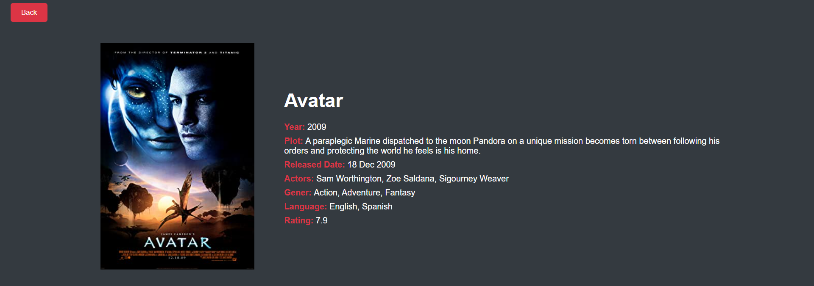
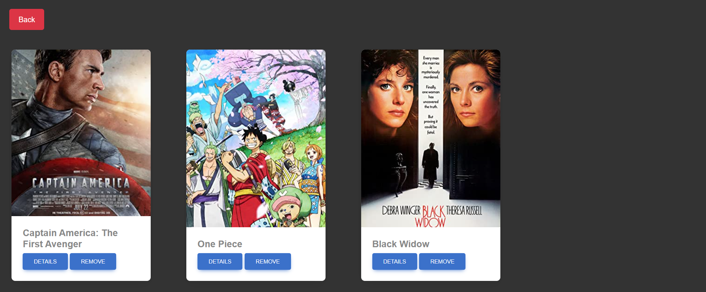

# OMDB MOVIE APP 

### Deployed URL :-

https://sahilmund.github.io/OMDB-Movie-APP/

### Technology Used :-
```
1. HTML
2. CSS
3. Vanilla JS
4. Bootstrap
```

### API USED :-

```
http://www.omdbapi.com/?apikey=<ADD_YOUR_PERSONAL_API_KEY>

```

### To run the application :-

```
1. Clone the Repository
2. Then add your API KEY in the API URL [you can get it from the omdbapi.com]
3. Then open the index.js page in broswer
```

### Features :-

### 1. Home Page :-


```
a. User can search any movie and the suggestion will be shown accordingly by fetching the data from the API and display the search results on the frontend similar to google suggestions.

b. Each search result of the movie have a favourite button, clicking on which the movie should be added to “My favourite movies”.

c. On clicking any particular search result (any movie), it will opem a new page with more information about that movie (movie page)
```
 </img>

### 2. Movie Page :- 
```
a. Will show information about the movie like its name, photo, plot, etc.
```
 </img>

### 3. My favourite movies Page :-
```
a. It will display a list of all the favourite movies.
b. Made this list persistent by adding the data in localstorage.
c. Each movie will have remove from favourites button, clicking on which will remove that movie from the list.
```

 </img>

